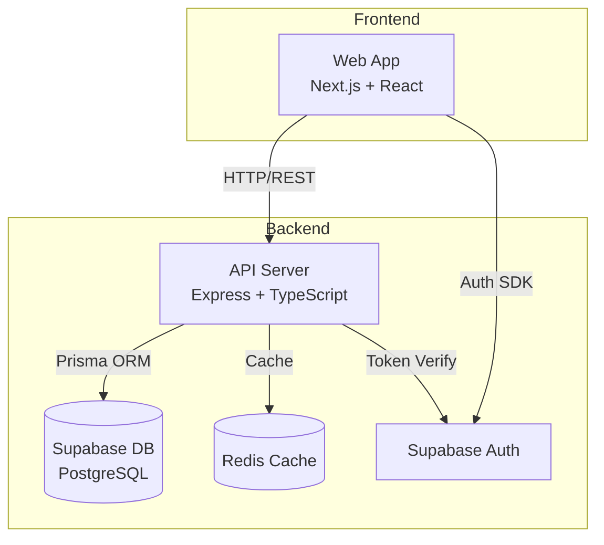

# TutorConnect Codebase Audit

## Project Snapshot
TutorConnect is a tutoring platform that connects students with tutors, facilitates session scheduling, and handles messaging and payments. Built with a modern TypeScript stack: Next.js frontend, Express.js backend, Supabase (PostgreSQL + Auth), and Redis caching. The codebase is in early development with core features implemented but requiring significant hardening and testing before production readiness.

## Architecture Overview



Key Components:
- **Web App**: Next.js application with React, handling UI/UX and client-side state
- **API Server**: Express.js backend with TypeScript, managing business logic and data access
- **Supabase DB**: PostgreSQL database with rich schema for users, sessions, messages
- **Redis Cache**: Message and session caching, rate limiting
- **Supabase Auth**: Authentication and user management

## Strengths
- Strong TypeScript usage throughout with well-defined interfaces and types
- Clean architecture separation between frontend/backend with clear API boundaries
- Comprehensive database schema with proper relations and constraints
- Modern tooling setup (Turbopack, ESLint, Prisma)
- Real-time messaging capabilities with WebSocket support
- Monorepo structure with shared packages for common code

## Gaps & Risks
| Area | Issue | Severity | Suggested Fix | Ref Files |
|------|--------|----------|---------------|-----------|
| Authentication | Mock auth in use, no proper Supabase integration | High | Implement proper Supabase auth flow | `apps/api/src/utils/supabaseAuth.ts` |
| Data Access | Direct Prisma calls in routes, no repository layer | Medium | Add repository pattern for data access | `apps/api/src/routes/*.ts` |
| Error Handling | Inconsistent error responses across API | Medium | Standardize error handling middleware | `apps/api/src/middleware/errorHandlers.ts` |
| State Management | No proper frontend state management for sessions | Medium | Implement proper state management (Zustand/Redux) | `apps/web/src/app/**/*.tsx` |
| Security | Missing input validation on several endpoints | High | Add request validation middleware | `apps/api/src/routes/*.ts` |
| Caching | Redis integration incomplete | Medium | Complete Redis implementation for caching | `apps/api/src/config/redis.ts` |

## Missing or Incomplete Tests

### Unit Test Gaps
- Frontend components lack tests (`apps/web/src/components/`)
- API route handlers untested (`apps/api/src/routes/`)
- Utility functions need coverage (`apps/api/src/utils/`)
- State management logic untested (`apps/web/src/store/`)

### Integration Test Gaps
- API endpoint integration tests missing
- Database interactions not tested
- WebSocket/real-time messaging flows untested
- Authentication flows lack e2e tests

### Coverage Estimate
Current test coverage is approximately 10-15% based on file analysis. No formal coverage reports found.

## Proposed Features & Enhancements

1. **Tutor Availability Calendar** – Interactive calendar for tutors to set availability and students to book sessions. High user impact for scheduling workflow, medium effort.

2. **Payment Integration** – Stripe integration for secure payments and tutor payouts. Critical for platform monetization, large effort due to compliance requirements.

3. **Real-time Session Updates** – WebSocket notifications for session status changes and instant messaging. Improves user experience and engagement, medium effort.

4. **Review System** – Allow students to rate and review tutors after sessions. Builds trust and helps with tutor discovery, small effort.

## Integration Test Plan

### Environments
- Local: Docker Compose setup with Postgres and Redis
- Staging: Supabase instance with test data
- CI: GitHub Actions with containerized services

### Scenarios
```
Feature: Session Booking

Scenario: Student books a session
  Given a logged-in student
  And a tutor with available slots
  When the student books a time slot
  Then the session is created
  And both users receive notifications
  And the tutor's availability is updated

Scenario: Message Exchange
  Given two users in a conversation
  When one user sends a message
  Then the other user receives it in real-time
  And the message is persisted
```

### Tooling
- Jest for unit tests
- Playwright for e2e tests
- Supertest for API integration tests
- Factory-based fixtures with Prisma
- Mock Supabase auth in tests

### CI Hooks
```yaml
test:integration:
  parallel: 3
  needs: [build, db:migrate]
  services:
    - postgres
    - redis
```

## Next Steps / Roadmap (90 days)

| Day 0-14 | Day 15-45 | Day 46-90 |
|----------|-----------|------------|
| 🔹 Fix auth implementation | 🔸 Add repository layer | ⭐ Complete test coverage |
| 🔹 Add request validation | 🔸 Implement caching | ⭐ Payment integration |
| 🔹 Setup proper error handling | 🔸 Add WebSocket support | ⭐ Production deployment |
| 🔹 Configure CI/CD | 🔸 Basic test coverage | ⭐ Performance optimization |

## Reference Appendix

### Key Directories
- `apps/web/`: Next.js frontend application
- `apps/api/`: Express backend API
- `packages/database/`: Shared database package with Prisma schema
- `docs/`: Project documentation

### Configuration Files
- `turbo.json`: Monorepo configuration
- `apps/api/tsconfig.json`: API TypeScript config
- `apps/web/next.config.ts`: Next.js configuration
- `packages/database/prisma/schema.prisma`: Database schema

### Metrics
➡️ TODO: Add metrics collection for:
- Bundle size analysis
- API response times
- Database query performance
- Test coverage reports 